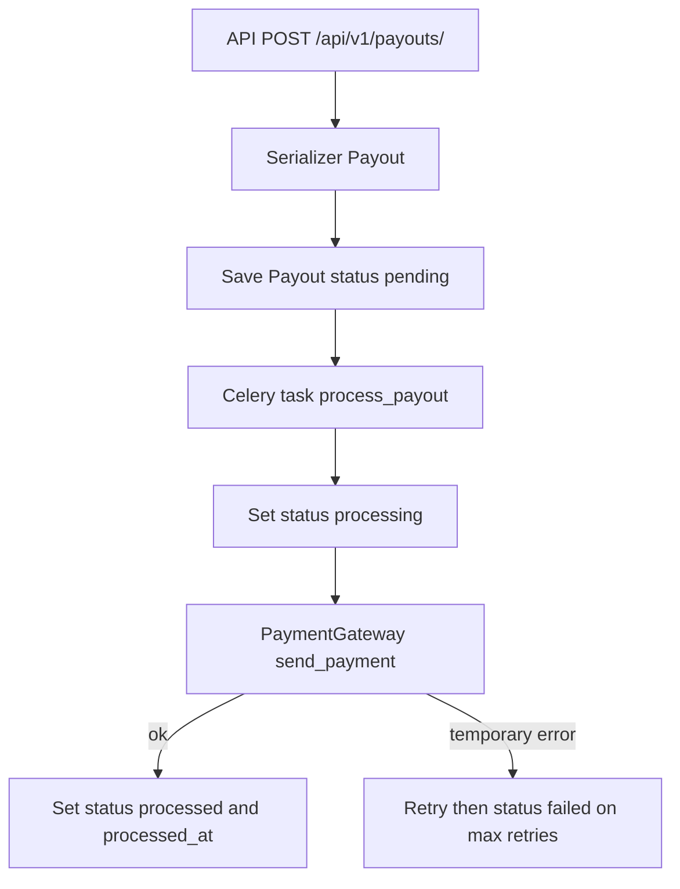

# Обзор схемы проекта: архитектура и данные

## Архитектура

Проект реализован по feature-based подходу: общий слой в `core` и доменная фича `payouts`.

- `core` — общая инфраструктура: настройки, middleware, трассировка, Celery-конфиг, общий роутинг.
- `payouts` — бизнес-фича обработки заявок на выплаты: модели, сериализация, API, фоновые задачи, внешние сервисы.

### Ключевые модули

- API роутинг: `core/urls.py` подключает фичу payouts и схему API (drf-spectacular).
- Payouts URLs: две ручки (создание и получение по id).
- Views: CreateAPIView и RetrieveAPIView.
- Celery: настройки и автопоиск задач.
- Tracing/middleware: прокидывание trace_id в логи и задачи.

### Входные точки

- HTTP API: `/api/v1/payouts/` (POST), `/api/v1/payouts/{id}/` (GET).
- Celery worker: задачи из `payouts.tasks`.

## Схема данных

### Модель `Payout`

| Поле | Тип | Ограничения/назначение |
|---|---|---|
| `id` | BigAutoField | PK |
| `user_id` | BigIntegerField | Индекс; идентификатор пользователя |
| `amount` | Decimal(10,2) | Сумма выплаты |
| `payout_method` | CharField(32) | Выбор: `bank_card`, `sbp` |
| `payout_details` | JSONField | Реквизиты выплаты |
| `status` | CharField(20) | Выбор: `pending`, `processing`, `processed`, `failed` |
| `created_at` | DateTime | auto_now_add |
| `processed_at` | DateTime | nullable; момент завершения |

Связей с другими сущностями нет. Индекс на `user_id`.

## Поток обработки заявки

## Риски/несоответствия и допущения

1. В `payouts.tasks.reconcile_processing_payouts` используется поле `processing_started_at`, которого нет в модели. Это приведёт к ошибке запроса.
2. В `process_payout` нет установки `processing_started_at` (если предполагалось).
3. В сериализаторе `amount` задан как Decimal(12,2), что расходится с моделью Decimal(10,2).
4. Реализованы только POST и GET по id; отсутствуют list/PATCH/DELETE, которые упоминались в ТЗ.
5. `PaymentGateway` сейчас всегда генерирует временную ошибку (заглушка), значит задача уйдёт в ретраи и в итоге FAILED.

## Предпосылки и контекст

Обзор построен по README и текущему коду модулей `core` и `payouts`.
